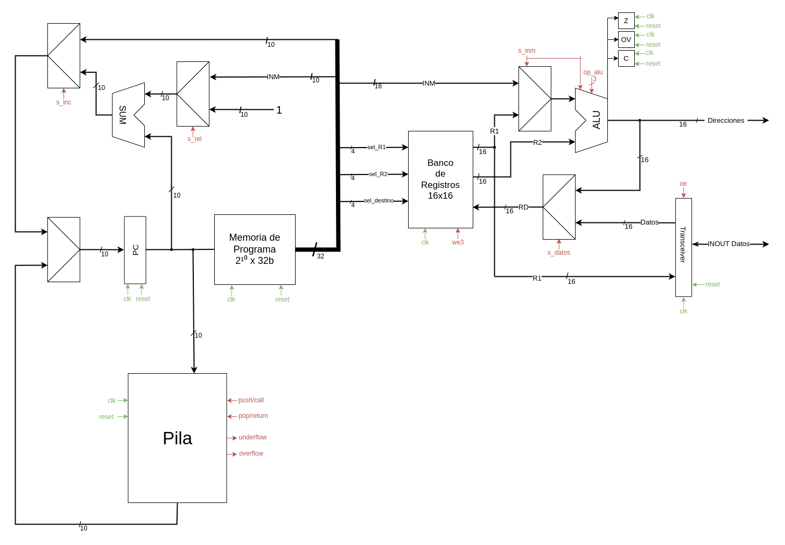

# Implementacion de una CPU monociclo

## Objetivo
El objetivo de esta práctica es desarrollar una CPU básica monociclo. Esta CPU en concreto es la CPU "avanzada" la cual posee las siguientes características:

- Tiene un tamaño de palabra de 32 bits.
- Posee una memoria de programa con un máximo de 1024 instrucciones.
- Una pila para subrutinas con control de overflow y underflow. // hacer control de overflow y underflow
- Operaciones aritmetico-lógicas con registros.
- Operaciones aritmetico-lógicas inmediatas
- Salto absoluto, salto si cero, salto si no cero y relativo.
- Modo de direcionamiento inmediato, directo y relativo. // hacer load y store
- Gestión jerarquica de interrupciones // hacer gestión


## Manejo básico
Estando desde el espacio de trabajo ejecutamos
```
./ejecutar.sh
```

Gracias a esto compilaremos el código ensamblador en c++, lo ejecutaremos con
un archivo pasado como parametro al main por defecto, se compilará verilog y 
se ejecutará una simulación.

Si quiere saber todas las opciones ejecute en terminal:
```
./ejecutar.sh -h  

    ó

./ejecutar.sh --help
```

## Diseño de la CPU

Este es el actual diseño de conexiones de la CPU.


