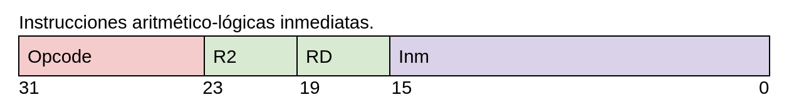
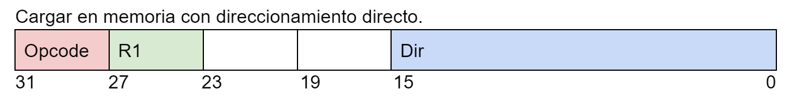
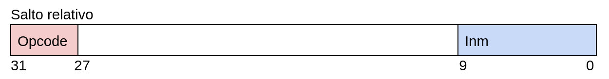

# Diseño de procesadores 2021-2022 Implementacion de una CPU monociclo

## Objetivo
El objetivo de esta práctica es desarrollar una CPU básica monociclo. Esta CPU en concreto es la CPU "avanzada" la cual posee las siguientes características:

- Tiene un tamaño de palabra de 32 bits.
- Posee una memoria de programa con un máximo de 1024 instrucciones.
- Una pila para subrutinas con control de overflow y underflow.
- Operaciones aritmetico-lógicas con registros.
- Operaciones aritmetico-lógicas inmediatas
- Salto absoluto, salto relativo salto si cero, salto si no cero y si negativo.
- Control de overflow para operaciones aritmetico-lógicas.
- Modo de direcionamiento directo y relativo.
- Gestión jerarquica de interrupciones.
- Gestión de entrada-salida con bus de direcciones y datos.

## Ensamblador
Como añadido se dispone de un ensamblador dado en clase en el que he implementado varias mejoras para poder usar todas las funciones de la CPU.

- Mnemonicos complejos (ble, bge, btl, bgt, bne, beq).
- Posibilidad de tener etiquetas que sean sufijo o prefijo de otra.
- Posibilidad de tener salto relativo.
- Posibilidad de tener varios ficheros de códigos para una misma memoria de programa, seleccionando simplemente su posición dentro de ella.


## cpu_exe.sh
Es un código realizado en bash para agilizar las pruebas sobre la CPU. El código se encarga de compilar el ensamblador, ejecutarlo con los ficheros que quiero pasar a binario en el progfile.mem, compilar el código verilog, ejecutarlo usando el test bench y finalmente tengo varias opciones, para por ejemplo, utilizar el GTKWave, pasar automaticamente los ficheros que necesito para hacer funcionar el código en Quartus II, etc.


## Diseño del camino de datos de la CPU

Este es el actual diseño de conexiones de la CPU.


## Codificación de instrucciones
### Aritmetico-lógicas registros

| Instrucción       | OPCODE    | Descripción               |
| :-----------:     | :-------: |---------------------------|
| **ALU (R1))**     | 1000      | Carga                     |
| **ALU (~R1)**     | 1001      | Complemento a 1           |
| **ALU (R1+R2)**   | 1010      | Suma                      |
| **ALU (R1-R2)**   | 1011      | Resta                     |
| **ALU (R1&R2)**   | 1100      | AND                       |
| **ALU (R1\|R2)**  | 1101      | OR                        |
| **ALU (-R1)**     | 1110      | Complemento a 2           |
| **ALU (-R2)**     | 1111      | Complemento a 2           |

### Aritmetico lógicas inmediatas

| Instrucción       | OPCODE    | Descripción               |
| :---------------: | :-------: |---------------------------|
| **ALU (inm)**     | 00010000  | Carga                     |
| **ALU (~inm)**    | 00010001  | Complemento a 1           |
| **ALU (inm+b)**   | 00010010  | Suma                      |
| **ALU (b-inm)**   | 00010011  | Resta                     |
| **ALU (inm&b)**   | 00010100  | AND                       |
| **ALU (inm\|b)**  | 00010101  | OR                        |
| **ALU (-inm)**    | 00010110  | Complemento a 2           |
| **ALU (-inm)**    | 00010111  | Complemento a 2           |


### Memoria





| Instrucción   | OPCODE    | Descripción                                                                           |
| :-----------: | :-------: |---------------------------------------------------------------------------------------|
| **STORE**     | 0000      | Carga en memoria                                                                      |
| **STORER**    | 0010      | Carga en memoria relativa a registro (si el inmediato es 0 es directo por registro)   |
| **LOAD**      | 0011      | Carga de memoria                                                                      |
| **LOADR**     | 0011      | Carga de relativa a registro (si el inmediato es 0 es directo por registro)           |

### Saltos


| Instrucción   | OPCODE    | Descripción               |
| :-----------: | :-------: |---------------------------|
| **j**         | 00011000  | Salto absoluto            |
| **jr**        | 00011001  | Salto relativo            |
| **jz**        | 00011010  | Salto relativo si cero    |
| **jnz**       | 00011011  | Salto relativo si no cero |
| **jne**       | 00011100  | Salto relativo si no cero |
| **jcall**     | 0101      | Salto relativo a subrutina|
| **jret**      | 0110      | Retorno de subrutina      |
| **reti**      | 00011101  | Retorno de interrupción   |

### Resto de instrucciones
| Instrucción   | OPCODE    | Descripción               |
| :-----------: | :-------: |---------------------------|
| **nop**       | 00011111  | Instrucción vacía         |


## Componentes
Para la realización de esta CPU se han necesitado varios componentes:
- Banco de registros: contiene 16 registros de 16 bits de ancho.
- Sumador: Usado para incrementar PC de diferentes maneras (decidiendo si 1 o salto realtivo).
- Registro: Usados para guardar el estado actual de su entrada hasta el siguiente flanco de subida del reloj, siempre y cuando el chip enable se encuentre alto.
- Multiplexores: Encontramos 2 tipos: el multiplexor 2 a 1 y el 4 a 1.
- Biestable tipo d: Para poder hacer los saltos si cero, si no cero, si negativo y para activar el error en caso de overflow.
- Max_priority_bit: Modulo que me indica el bit menos significativo de un número binario, para poder elegir la prioridad en las interrupciones.
- Transceiver: Para manejar el bus inout de datos que va hacia afuera de la CPU.


## Pila


La pila es síncrona y como se ve en la imagen, "malgasto" la primera posición de la pila para tener un estado empty. Necesario para poder controlar cuando la pila está vacía y cuando habrá un underflow. También se posee control sobre el overflow.

Este control se realiza añadiendo un bit más al sp.


## Unidad aritmetico-lógica
Lo que hay que destacar de esta unidad es el control de overflow, la señal de zero, zero_intr, carry y carry_intr.

El overflow lo dividí en 3 tipos:
- Overflow en la suma: Solo habría que mirar y el bit más significativo de a y b coincide con el de y, solo habría 2 casos:
    - Los dos son negativos y la salida sale positiva (underflow)
    - Los dos son positivos y la salida sale negativa (overflow)

- Overflow en la resta: Este se complicaba un poco porque en las operaciones inmediatas se le da la vuelta a operación para que el inmediato reste al registro y no al revés, por lo que tenía que tener en cuenta los dos casos, pero simplemente es tener en cuenta que es lo mismo pero al revés:
    - Cuando el primer operando es negativo y el segundo operando es positivo (resta) y el resultado sale positivo.
    - Cuando primer operando es positivo y segundo operando es negativo (suma) y el resultado sale negativo.

- Overflow en complemento a 2: En este solo hay un caso muy concreto:
    - Hacer complemento a 2 del número mínimo representable con 16 bits.

El carry es usado para el salto si negativo.
Hay un carry_intr porque no se debe permitir perder el valor de carry si se salta a una interrupción.

El zero se usa para el salto si cero o salto si no cero.
El zero_intr tiene la misma explicación que carry_intr.

Luego teniendo en cuenta los inmediatos, a la hora de hacer restas me aseguro de que este siempre reste al registro, que por diseño, siempre será la primera posición. Por lo que se tiene un flag s_inm que también sirve para invertir las posiciones en las restas.


## Unidad de control


Un bloque always que no sea `*` normalmente no es lo que queremos ya que la máquina se dedicará a guardar el reg, creando un registro virtual. Como mi objetivo es tener una unidad de control completamente combinacional es necesario tener esta `*` en la lista de sensibilidad del always.

Para disminuir el número de comparaciones que tiene que hacer cada variable dentro de cada bloque always he separado el módulo de la unidad de control en otros dos modulos: Uno dedicado a tratar las interrupciones y errores y otro para el uso normal de la máquina (usando el opcode).

Como la única señal que coincide entre los dos bloques always es `control`, como se puede ver en el diagrama de arriba, he realizado dos salidas distintas para luego unirlas con una puerta lógica or. Esto funciona porque cuando la salida de control es diferente de cero en uno de los dos módulos, en el otro si lo estará gracias a las señales de control de errores y de interrupciones. 

Para un uso más sencillo de las señales, se han usado una serie de parámetros que se asignan, según el caso en el que se encuentre,
al reg de control nombrado anteriormente.

Se ha de resaltar que en el diagrama se encuentra una señal interrupt que en el código es en realidad: 
```verilog
((min_bit_s != 0 && min_bit_a == 0) || min_bit_s < min_bit_a)
```

Pero se ha puesto como una señal para facilitar la lectura del diseño.


## Interrupciones


La CPU cuenta con un sistema de interrupcciones jerárquico. Posee de un total de 8 interrupciones.

Para realizar esto se han utilizado 2 registros, uno de selección y otro de atención donde la interrupción de mayor prioridad será el del bit
menos significativo, por lo que, si llega a selección una interrupción con mayor prioridad a la que se encuentra en atención, se parará el opcode de la instrucción actual
para saltar a la subrutina dedicada a esa interrupción concreta y haciendo otro push a la pila, luego podrá volver a la interrupción anterior siguiendo la prioridad, haciendo uso de reti (un pop en la pila). 

Se tienen como máximo 8 interrupciones que se pueden interrumpir entre ellas si se diera el caso. Como el tamaño de la pila es mayor, en principio no debería haber ningún problema. De todos modos hay que andar con ojo si disponemos de muchas subrutinas encadenadas además de estas interrupciones.

Las 2 interrupciones más prioritarias se utilizan para errores como overflow o underflow de la pila y para lo mismo en la ALU.
Y la menos prioritaria es utilizada para las interrupciones del timer.


## Biestables

### Biestables en las interrupciones
Es necesario tener biestables propios para las interrupciones porque es preciso mantener el estado de los biestables del programa principal justo en el momento en el que se para el opcode para atender una interrución cuando se iba a decirdir un salto. Cuando vuelva de la interrupción, la operación anterior dada para decidir el salto es como si nunca se hubiera producido.

Además no sería bueno limitar los saltos en las interrupciones en si, con el fin de mantener el valor cuando volvamos. Por lo que decidí duplicar los biestables
para guardar los del programa principal y poder seguir teniendo saltos en medio de interrupciones.


## Entrada Salida (Ecosistema de la CPU)


Se dispone de una memoria SRAM a la que tenemos acceso a la mitad de los datos (256KBytes), ya que tenemos fijados los bits de selección del upper y lower de la memoria a lower.

También se tiene acceso a los 10 leds Rojos, 8 leds Verdes, 10 switches y 4 botones.

Para poder comunicarnos entre todos estos elementos he realizado un mapeo de la memoria, donde ciertas direcciones de memoria son los leds, switches y botones; lo demás para direccionar en la memoria SRAM.

Para hacer loads y stores se ha usado un transceiver en la cpu, que nos permite tener un bus de datos bidireccional, para poder comunicarnos con la memoria cuando su oe esté activado y controlar los leds y demás e/s con el oe propio del transceiver, que se encuentra en io_manager.


# Quartus II
## Software

## Problemas

### Slacks negativos
Hay instrucciones que producen slacks negativos y hasta incluso asignar más pines le afecta.


### Solución para los slacks negativos
La solución ha sido bajar la frecuencia de reloj a 24MHz, siendo el periodo de 41ns.

Con 27MHz todavía seguían dando slacks negativos.


### Program Counter no va bien
He puesto el reloj en un botón y muestro el program counter en los leds rojos.

Todo va como se espera pero cuando salta la interrupción del timer al volver no salta bien a atrás.

Además si muestro en un led el s_reti, se ve que está en triestado.

### Solución
El problema era que había un bucle lógico entre la unidad de control y el inter_manager.
Cambié el diseño de los bloques always y en vez de usar data_s para calcular la interrupción
uso int_s en el min_bit_s.

Aquí el problema más grave era data_s, ya que el return borraba
su bit, por lo que cambiaba el min_bit_s, y volvía a chequear el return
y volvía a borrar ese bit y cambiaría otra vez min_bit_s.

Al cambiar a int_s el min_bit_s, nos encontramos en un valor estable todo el ciclo.


### Problema en el store
Tengo un ejemplo de que se encienden o apagan los leds verdes según corresponda.

En este ejemplo se encienden correctamente los leds y se apagan pero luego no se vuelven a encender nunca más
Y eso que salta bien, por lo que debe de haber algún tipo de problema en el store porque al saltar bien significa que el
load lo hace correctamente.


### Solución
Hacer que en el bloque always se pueda poner una `*` en la lista de sensibilidad. Además también es necesario que los if siempre tengan un else
correspondiente que tenga lo que deben valer.


# Proyecto libre
He realizado un datalogger, el cual tiene un estado recogida de datos y un estado mostrar datos.

Se utilizan los botones para realizar esto:
- KEY0: Es usado para activar el modo recogida de datos.
- KEY3: Es usado para guardar el estado actual de los switches en la SRAM.
- KEY1: Limpiamos los leds y los estados.
- KEY2: Activamos el modo mostrar que enseñará los estados.

Para ello he usado el ensamblador que he mejorado en dos ficheros que se encuentran en el directorio assembly.
El programa principal se encuentra en `software.asm` y las interrupciones del timer en `timer.asm`.

El programa principal solo trata de encender flags o no segun corresponda.
El código del timer trata de saltar a la etiqueta correspondiente según el flag que esté activado.

[Link de la demostración](https://youtu.be/qvEXRC6JKvs)
