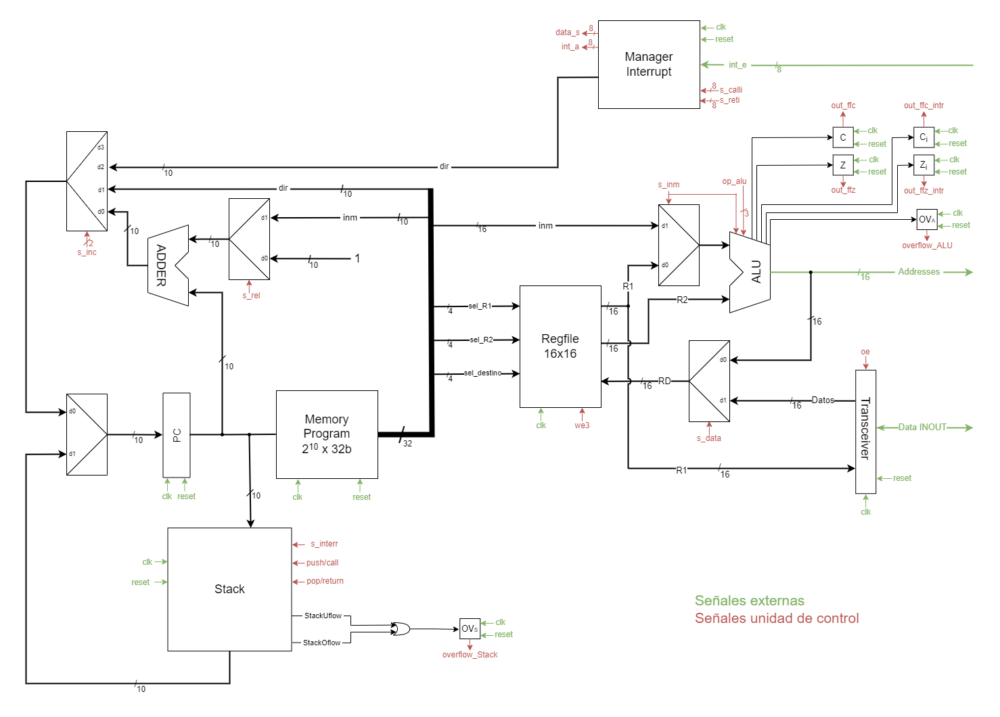

# Diseño de procesadores 2021-2022 Implementacion de una CPU monociclo

## Objetivo
El objetivo de esta práctica es desarrollar una CPU básica monociclo. Esta CPU en concreto es la CPU "avanzada" la cual posee las siguientes características:

- Tiene un tamaño de palabra de 32 bits.
- Posee una memoria de programa con un máximo de 1024 instrucciones.
- Una pila para subrutinas con control de overflow y underflow.
- Operaciones aritmetico-lógicas con registros.
- Operaciones aritmetico-lógicas inmediatas
- Salto absoluto, salto relativom salto si cero, salto si no cero y si negativo.
- Control de overflow para operaciones aritmetico-lógicas.
- Modo de direcionamiento directo y relativo.
- Gestión jerarquica de interrupciones.
- Gestión de entrada-salida por el bus de direcciones y datos.


## Manejo básico
Estando desde el espacio de trabajo ejecutamos
```
./ejecutar.sh
```

Gracias a esto compilaremos el código ensamblador en c++, lo ejecutaremos con
un archivo pasado como parametro al main por defecto, se compilará verilog y 
se ejecutará una simulación.

Si quiere saber todas las opciones ejecute en terminal:
```
./ejecutar.sh -h  

    ó

./ejecutar.sh --help
```

## Diseño del camino de datos de la CPU

Este es el actual diseño de conexiones de la CPU.




## Codificación de instrucciones
### Aritmetico-lógicas registros

| Instrucción       | OPCODE    | Descripción               |
| :-----------:     | :-------: |---------------------------|
| **ALU (R1))**     | 1000      | Carga                     |
| **ALU (~R1)**     | 1001      | Complemento a 1           |
| **ALU (R1+R2)**   | 1010      | Suma                      |
| **ALU (R1-R2)**   | 1011      | Resta                     |
| **ALU (R1&R2)**   | 1100      | AND                       |
| **ALU (R1\|R2)**  | 1101      | OR                        |
| **ALU (-R1)**     | 1110      | Complemento a 2           |
| **ALU (-R2)**     | 1111      | Complemento a 2           |

### Aritmetico lógicas inmediatas

| Instrucción       | OPCODE    | Descripción               |
| :---------------: | :-------: |---------------------------|
| **ALU (inm)**     | 00010000  | Carga                     |
| **ALU (~inm)**    | 00010001  | Complemento a 1           |
| **ALU (inm+b)**   | 00010010  | Suma                      |
| **ALU (b-inm)**   | 00010011  | Resta                     |
| **ALU (inm&b)**   | 00010100  | AND                       |
| **ALU (inm\|b)**  | 00010101  | OR                        |
| **ALU (-inm)**    | 00010110  | Complemento a 2           |
| **ALU (-inm)**    | 00010111  | Complemento a 2           |


### Memoria


| Instrucción   | OPCODE    | Descripción                                                                           |
| :-----------: | :-------: |---------------------------------------------------------------------------------------|
| **STORE**     | 0000      | Carga en memoria                                                                      |
| **STORER**    | 0010      | Carga en memoria relativa a registro (si el inmediato es 0 es directo por registro)   |
| **LOAD**      | 0011      | Carga de memoria                                                                      |
| **LOADR**     | 0011      | Carga de relativa a registro (si el inmediato es 0 es directo por registro)           |

### Saltos


| Instrucción   | OPCODE    | Descripción               |
| :-----------: | :-------: |---------------------------|
| **j**         | 00011000  | Salto absoluto            |
| **jr**        | 00011001  | Salto relativo            |
| **jz**        | 00011010  | Salto relativo si cero    |
| **jnz**       | 00011011  | Salto relativo si no cero |
| **jne**       | 00011100  | Salto relativo si no cero |
| **jcall**     | 0101      | Salto relativo a subrutina|
| **jret**      | 0110      | Retorno de subrutina      |
| **reti**      | 00011101  | Retorno de interrupción   |

### Resto de instrucciones
| Instrucción   | OPCODE    | Descripción               |
| :-----------: | :-------: |---------------------------|
| **nop**       | 00011111  | Instrucción vacía         |


## Componentes
Para la realización de esta CPU se han necesitado varios componentes:
- Banco de registros: contiene 16 registros de 16 bits de ancho.
- Sumador: Usado para incrementar PC de diferentes maneras (decidiendo si 1 o salto realtivo).
- Registro: Usados para guardar el estado actual de su entrada hasta el siguiente flanco de subida del reloj, siempre y cuando el chip enable se encuentre alto.
- Multiplexores: Encontramos 2 tipos: el multiplexor 2 a 1 y el 4 a 1.
- Biestable tipo d: Para poder hacer los saltos si cero, si no cero, si negativo y para activar el error en caso de overflow.
- Max_priority_bit: Modulo que me indica el bit menos significativo de un número binario, para poder elegir la prioridad en las interrupciones.
- Transceiver: Para manejar el bus inout de datos que va hacia afuera de la CPU.

## Pila


La pila es sincrona y solo cambia de estado cuando hay un reset, un push o un pop en el proximo flanco de reloj.


## Unidad aritmetico-lógica
Lo que hay que destacar de esta unidad es el control de overflow, la señal de zero, zero_intr, carry y carry_intr.

El overflow lo dividí en 3 tipos:
- Overflow en la suma: Solo habría que mirar y el bit más significativo de a y b coincide con el de y, solo habría 2 casos:
    - Los dos son negativos y la salida sale positiva (underflow)
    - Los dos son positivos y la salida sale negativa (overflow)

- Overflow en la resta: Este se complicaba un poco porque en las operaciones inmediatas se le da la vuelta a operación para que el inmediato reste al registro y no al revés, por lo que tenía que tener en cuenta los dos casos, pero simplemente es tener en cuenta que es lo mismo pero al revés:
    - Cuando el primer operando es negativo y el segundo operando es positivo (resta) y el resultado sale positivo.
    - Cuando primer operando es positivo y segundo operando es negativo (suma) y el resultado sale negativo.

- Overflow en complemento a 2: En este solo hay un caso muy concreto:
    - Hacer complemento a 2 del número mínimo representable con 16 bits.

El carry es usado para el salto si negativo.
Hay un carry_intr porque no se debe permitir perder el valor de carry si se salta a una interrupción.

El zero se usa para el salto si cero o salto si no cero.
El zero_intr tiene la misma explicación que carry_intr.


## Unidad de control


Dentro de la unidad de control, para un uso más sencillo de las señales se han usado una serie de parametros que se asignan según el caso en el que se encuentre,
a un reg de control es asignado a una concatenación de casi todas las señales de salida de la UC. El op_alu es una excepción por su facilidad al asignarle parte del 
opcode.

## Biestables

### Biestables en las interrupciones
Es necesario tener biestables propios de interrupciones porque es preciso mantener el valor de los biestables del programa de ejecución normal de la CPU por si hay una interrupción
justo cuando vamos a decidir un salto.

Además no sería bueno limitar los saltos en las interrupciones en si. Por esta razón nacieron
los biestables de salto en las interrupciones.