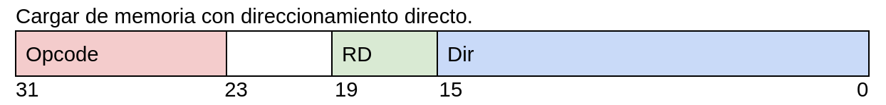

# Diseño de procesadores 2021-2022 Implementacion de una CPU monociclo

## Objetivo
El objetivo de esta práctica es desarrollar una CPU básica monociclo. Esta CPU en concreto es la CPU "avanzada" la cual posee las siguientes características:

- Tiene un tamaño de palabra de 32 bits.
- Posee una memoria de programa con un máximo de 1024 instrucciones.
- Una pila para subrutinas con control de overflow y underflow.
- Operaciones aritmetico-lógicas con registros.
- Operaciones aritmetico-lógicas inmediatas
- Salto absoluto, salto si cero, salto si no cero y relativo.
- Modo de direcionamiento inmediato, directo y relativo.
- Gestión jerarquica de interrupciones


## Manejo básico
Estando desde el espacio de trabajo ejecutamos
```
./ejecutar.sh
```

Gracias a esto compilaremos el código ensamblador en c++, lo ejecutaremos con
un archivo pasado como parametro al main por defecto, se compilará verilog y 
se ejecutará una simulación.

Si quiere saber todas las opciones ejecute en terminal:
```
./ejecutar.sh -h  

    ó

./ejecutar.sh --help
```

## Diseño de la CPU

Este es el actual diseño de conexiones de la CPU.


## Codificación de instrucciones
### Aritmetico-lógicas registros

| Instrucción       | OPCODE    | Descripción               |
| :-----------:     | :-------: |---------------------------|
| **ALU (R1))**     | 1000      | Carga                     |
| **ALU (~R1)**     | 1001      | Complemento a 1           |
| **ALU (R1+R2)**   | 1010      | Suma                      |
| **ALU (R1-R2)**   | 1011      | Resta                     |
| **ALU (R1&R2)**   | 1100      | AND                       |
| **ALU (R1\|R2)**  | 1101      | OR                        |
| **ALU (-R1)**     | 1110      | Complemento a 2           |
| **ALU (-R2)**     | 1111      | Complemento a 2           |

### Aritmetico lógicas inmediatas

| Instrucción       | OPCODE    | Descripción               |
| :---------------: | :-------: |---------------------------|
| **ALU (inm)**     | 1000      | Carga                     |
| **ALU (~inm)**    | 1001      | Complemento a 1           |
| **ALU (inm+b)**   | 1010      | Suma                      |
| **ALU (b-inm)**   | 1011      | Resta                     |
| **ALU (inm&b)**   | 1100      | AND                       |
| **ALU (inm\|b)**  | 1101      | OR                        |
| **ALU (-inm)**    | 1110      | Complemento a 2           |
| **ALU (-inm)**    | 1111      | Complemento a 2           |


### Memoria



| Instrucción   | OPCODE    | Descripción                   |
| :-----------: | :-------: |-------------------------------|
| **LOAD**      | 00010000  | Carga de memoria              |
| **LOADR**     | 00010001  | Carga de memoria por registro |
| **STORE**     | 00010010  | Carga en memoria              |

### Saltos


| Instrucción   | OPCODE    | Descripción               |
| :-----------: | :-------: |---------------------------|
| **j**         | 00010100  | Salto absoluto            |
| **jr**        | 00010101  | Salto relativo            |
| **jz**        | 00010110  | Salto si cero             |
| **jnz**       | 00010110  | Salto si no cero          |
| **jcall**     | 00010111  | Salto relativo a subrutina|
| **jret**      | 00010111  | Retorno de subrutina      |
| **reti**      | 00010111  | Retorno de interrupción   |

### Resto de instrucciones
| Instrucción   | OPCODE    | Descripción               |
| :-----------: | :-------: |---------------------------|
| **nop**       | 00010111  | Instrucción vacía         |


## Biestables

### Biestables en las interrupciones
Necesitamos biestables que trabajen cuando estamos en una interrupción porque necesitamos mantener
el valor de los biestables del programa de ejecución normal de la CPU por si hay una interrupción
justo cuando vamos a decidir un salto.

Además no sería bueno limitarnos los saltos en las interrupciones en si. Por esta razón nacieron
los biestables de salto en las interrupciones.